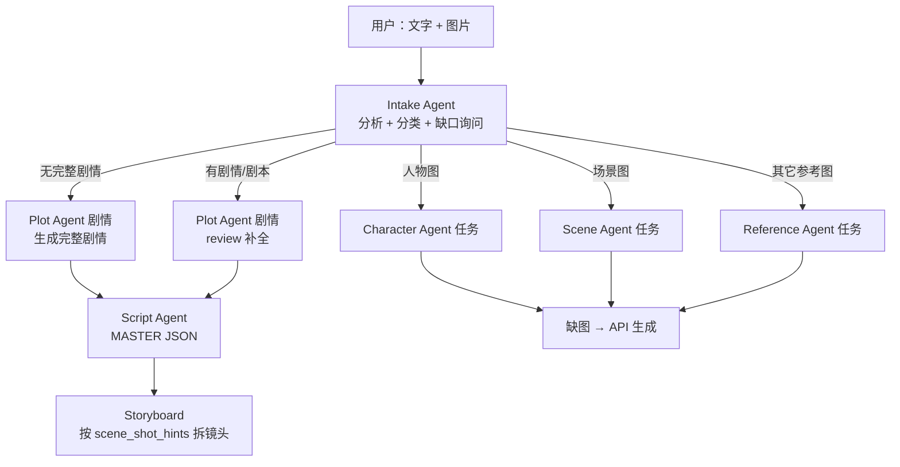
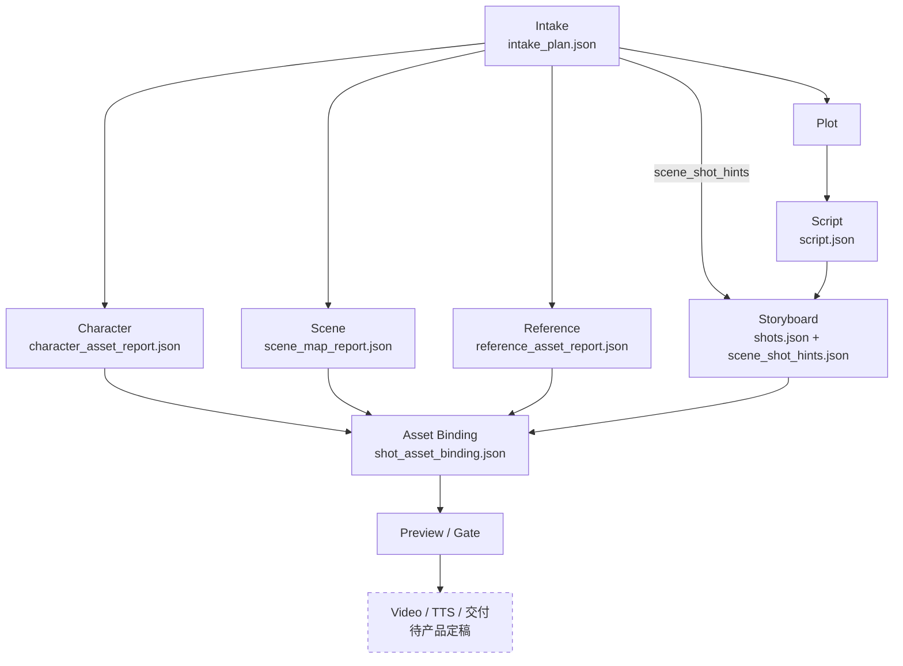

# PIP 架构（唯一权威）

> **状态：** Multi-Agent 五路分叉已接入 orchestrator（2026-06-08）  
> **代码入口：** `src/video_pipeline/orchestrator.py` → `_run_post_intake_branches`

---

## Multi-Agent 定稿结构



### 结构语义

| 分支 | 触发 | Agent | 职责 |
|------|------|-------|------|
| 叙事 | 无完整剧情 | Plot | 生成 **完整剧情** `full_plot` |
| 叙事 | 有剧情/剧本 | Plot | review 补全 |
| 叙事 | Plot 后 | Script | MASTER JSON |
| 叙事 | Script 后 | Storyboard | 按 `scene_shot_hints` → `shots.json` |
| 资产 | 人物图 | Character | 三视图/多角度包 |
| 资产 | 场景图 | Scene | master + 多角度包 |
| 资产 | 其它参考图 | Reference | 参考图归档 / 缺图 API 生成 |
| 资产 | 汇合 | — | **缺图 → API 生成** |

**Intake 契约：** `intake/intake_plan.json`

---

## Orchestrator 执行顺序（对齐定稿）

Intake 之后不是一条直线，而是 **叙事链 + 资产链**：

```text
intake_done
  → plot_done
  → [并行] Reference Agent  +  Script Agent  → scripted / reference_assets_ready
  → [并行] Character Agent + Scene Agent + Storyboard Agent
  → character_assets_ready + scene_maps_ready + storyboarded
  → Asset Binding → Preview → 审批
  → （视频 / TTS / 后期 / 交付 — 待产品定稿，代码中有占位实现）
```

### 上游链接总图（含 Asset Binding）



**链接要点：** `scene_shot_hints` 从 Intake 进 Storyboard；三份资产 report + `shots.json` 在 Binding 阶段按 `scene_id` / `character_ids` / `linked_reference_ids` 对齐，写回 `shots.json` 后供 Preview / Gate 使用。

| 阶段 | 模块 | 产物 |
|------|------|------|
| Intake | `agents/intake_agent.py` | `intake_plan.json` |
| Plot | `agents/plot_agent.py` | `plot_plan.json`, `plot_narrative.txt` |
| Script | `agents/script_agent.py` | `script.json` |
| Storyboard | `agents/storyboard_agent.py` | `shots.json`, `scene_shot_hints.json` |
| Reference | `pipeline/reference_assets.py` | `assets/references/`, `reference_asset_report.json` |
| Character | `pipeline/character_assets.py` | `assets/characters/*_turnaround/` |
| Scene | `pipeline/scene_maps.py` | `scene_maps/*` |
| 下游 | preview / gate / （generation 等占位） | 审批后执行层 **待产品定稿** |

---

## 下游执行层（待产品定稿）

Multi-Agent 上游（Intake 五路）是定稿结构。**视频怎么生成、用什么模型、是否 keyframe、如何混音交付** 尚未作为产品架构定稿。

仓库里 `routing_agent.py`、`generation.py` 等是 **可跑的占位实现**，不代表最终方案。讨论架构时以本节 Intake 分叉图为准，不要把占位代码当成已定产品形态。

---

## Job 状态（Intake 之后）

```text
intake_done → plot_done → scripted → reference_assets_ready
  → character_assets_ready + scene_maps_ready + storyboarded
  → assets_bound
  → preview_ready → awaiting_storyboard_approval → storyboard_approved
  → routed → generated → delivered
```

---

## 工程约束

- `script.json`：Script 阶段后的叙事单一事实来源
- Artifact-first：每 Agent 读写明确 JSON
- 审批前不调视频 API
- Mock：`pytest tests/ -q`

---

## 相关文档

| 文件 | 用途 |
|------|------|
| **`docs/ARCHITECTURE.md`** | 本文件 |
| `docs/RESUME_HERE.md` | 续开发 |
| `.cursor/rules/pip-flow-architecture.mdc` | 会话规则（与本图一致） |
