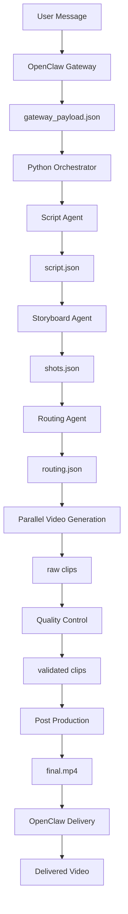

# Multi-Agent Video Pipeline Architecture / 多 Agent 视频流水线架构

## 1. Product Goal / 产品目标

Build a local-Mac-first MVP that converts one natural language message into a finished short video with no manual editing.

构建一个优先在 Mac 本机运行的 MVP：用户发送一条自然语言消息，系统自动生成完整短视频，无需人工剪辑。

The system must support:

系统必须支持：

- Telegram or WhatsApp input and output.
- Telegram 或 WhatsApp 输入与回传。
- Script generation from global rules and character library.
- 基于全局规则和角色库生成剧本。
- Shot splitting, model routing, parallel generation, QC, assembly, subtitles, music, and delivery.
- 分镜拆解、模型路由、并行生成、质检、合成、字幕、配乐和自动发送。
- Independent retry per failed shot.
- 单个失败镜头独立重试，不阻塞其他镜头。

## 2. Core Principle / 核心原则

`script.json` is the single source of truth after the Script Agent finishes.

`Script Agent` 完成后，`script.json` 是唯一事实来源。

Downstream agents should never reinterpret the original user prompt unless explicitly asked by the orchestrator. They should read structured JSON artifacts and human-editable rule files.

下游 Agent 不应重新解释用户原始输入，除非主控流程明确要求。下游只读取结构化 JSON 产物和可人工维护的规则文件。

## 3. Runtime Flow / 运行流程



## 4. Layer Responsibilities / 分层职责

| Layer 层级 | Responsibility 职责 | Input 输入 | Output 输出 |
|---|---|---|---|
| OpenClaw Gateway | Listen to Telegram or WhatsApp, normalize the incoming message. 监听 Telegram 或 WhatsApp，并标准化消息。 | `text`, `channel`, `user_id`, `timestamp` | `gateway_payload.json` |
| Python Orchestrator | Own job lifecycle, call each stage, persist artifacts. 管理任务生命周期，调用每个阶段并保存产物。 | `gateway_payload.json` | job folder, logs, reports |
| Script Agent | Generate the full creative plan from rules and characters. 根据规则和角色库生成完整创意剧本。 | `raw_prompt`, `MASTER.md`, `CHARACTERS.md` | `script.json` |
| Storyboard Agent | Split script into shots and inject character prompts. 拆分分镜并注入角色提示词。 | `script.json`, `STORYBOARD.md`, `CHARACTERS.md` | `shots.json` |
| Routing Agent | Select primary and fallback models plus cost estimate. 选择首选/备用模型并估算成本。 | `shots.json`, `ROUTING.md` | `routing.json` |
| Generation Workers | Generate clips concurrently with fallback. 并行生成视频片段，失败自动备用模型重试。 | `routing.json`, shot prompts | `clip_*.mp4` |
| Quality Control | Validate clip duration, resolution, fps, blank frames, file integrity. 校验时长、分辨率、帧率、空帧和文件完整性。 | raw clips | `qc_report.json`, validated clips |
| Post-production | Assemble video, transitions, subtitles, music fade. 合成视频、转场、字幕、配乐淡出。 | validated clips, `script.json` | `final.mp4`, `final.srt` |
| Delivery | Send final video back through the original channel. 通过原渠道发送最终视频。 | `final.mp4`, user info | delivery log |

## 5. Recommended Technical Stack / 推荐技术栈

### Gateway / 网关

- Node.js 20+ for OpenClaw daemon integration.
- Node.js 20+ 用于 OpenClaw 常驻进程集成。
- Telegram Bot API for first MVP channel.
- 第一阶段建议先接 Telegram Bot API。
- WhatsApp Cloud API for production-friendly WhatsApp support.
- WhatsApp 生产方案建议使用 WhatsApp Cloud API。
- Baileys can be considered for local WhatsApp prototype only.
- Baileys 只建议用于本地 WhatsApp 原型。

### Backend Orchestration / 后端主控

- Python 3.11+.
- `asyncio` for concurrent stage execution.
- `pydantic` for strict schemas.
- `aiohttp` for async API calls.
- `tenacity` for retry policy.
- `structlog` for JSON logs.
- SQLite for local job state.
- FFmpeg and ffprobe for media assembly and inspection.
- OpenCV for blank frame detection.

### AI and Video Providers / AI 与视频模型

- Claude API for Script Agent and Storyboard Agent.
- Claude API 用于剧本 Agent 和分镜 Agent。
- Python deterministic rules for Routing Agent.
- 路由 Agent 使用 Python 确定性规则，避免成本和不稳定性。
- Seedance for character-heavy high-motion shots.
- Seedance 用于人物和强动作镜头。
- Kling for realistic scene and fallback generation.
- Kling 用于写实场景和备用生成。
- Wan T2V for simple low-cost batch shots.
- Wan T2V 用于简单低成本批量镜头。

## 6. Data Contracts / 数据契约

### `gateway_payload.json`

```json
{
  "raw_prompt": "Create a 30 second cyberpunk chase video",
  "channel": "telegram",
  "user_id": "123456",
  "timestamp": "2026-05-28T17:30:00-07:00"
}
```

### `script.json`

```json
{
  "narrative_arc": "setup -> chase -> reveal -> ending",
  "visual_style": "cinematic cyberpunk realism",
  "color_tone": "neon blue and magenta",
  "music_mood": "tense electronic",
  "music_bpm": 128,
  "camera_language": "handheld tracking with fast push-ins",
  "characters_in_use": ["hero", "drone_guard"],
  "total_duration_sec": 30,
  "scene_list": []
}
```

### `shots.json`

```json
{
  "shots": [
    {
      "shot_id": "shot_001",
      "duration_sec": 5,
      "subject": "hero running through alley",
      "camera_move": "tracking shot",
      "action": "sprints past neon signs",
      "mood": "tense",
      "scene_type": "realistic",
      "motion_intensity": "high",
      "has_characters": true,
      "character_prompts": ["hero: ..."],
      "preferred_model": null,
      "fallback_model": null
    }
  ]
}
```

### `routing.json`

```json
{
  "routes": [
    {
      "shot_id": "shot_001",
      "preferred_model": "seedance",
      "fallback_model": "kling",
      "estimated_cost_per_shot": 0.45
    }
  ],
  "total_estimated_cost": 3.6
}
```

### `qc_report.json`

```json
{
  "job_id": "job_20260528_173000",
  "target_resolution": "1920x1080",
  "target_fps": 24,
  "passed_shot_ids": ["shot_001"],
  "failed_shot_ids": [],
  "checks": []
}
```

## 7. Reliability Rules / 可靠性规则

- Every stage writes its output before the next stage starts.
- 每个阶段必须先落盘输出，再进入下一阶段。
- Failed generation retries only the failed shot.
- 生成失败只重试失败镜头。
- Preferred model gets one normal attempt plus configured retries.
- 首选模型有一次正常调用和配置化重试。
- Fallback model runs only after preferred model is exhausted.
- 备用模型只在首选模型耗尽后触发。
- QC failures re-enter generation for the same shot ID.
- 质检失败会以同一个 `shot_id` 重新进入生成流程。
- A job is resumable from the latest valid artifact.
- 任务必须可以从最近的有效产物恢复。

## 8. Architecture Decisions / 架构决策

These decisions are binding for the MVP implementation.

以下决策是 MVP 实现必须遵守的工程约束。

### Decision 1: Bounded Parallelism / 有上限并行

Generation workers are logically parallel, but the implementation must use a configured concurrency limit instead of firing every API request without restraint.

生成层在逻辑上是并行的，但实现上必须使用配置化并发上限，不能无限制同时请求所有视频 API。

- Default: `MAX_CONCURRENT_SHOTS=4`.
- 默认值：`MAX_CONCURRENT_SHOTS=4`。
- Each shot remains isolated: one failed shot must not cancel successful or in-progress shots.
- 每个镜头仍然独立：单个失败镜头不能取消其他成功或生成中的镜头。
- Provider-specific rate limits may further reduce concurrency per model.
- 不同模型供应商的限流规则可以进一步限制单模型并发。

### Decision 2: Cost Gate Before Generation / 生成前成本闸门

The Routing Agent must estimate cost before any real video API call is made.

路由 Agent 必须在任何真实视频 API 调用之前完成成本估算。

- If `total_estimated_cost <= MAX_JOB_COST_USD`, generation can continue.
- 如果 `total_estimated_cost <= MAX_JOB_COST_USD`，可以继续生成。
- If `total_estimated_cost > MAX_JOB_COST_USD`, the job must stop before generation and return a user-facing budget message.
- 如果 `total_estimated_cost > MAX_JOB_COST_USD`，任务必须在生成前停止，并返回面向用户的预算提示。
- Cost reports are saved even when generation is stopped.
- 即使任务因预算停止，也必须保存成本报告。

### Decision 3: Routing Owns Model Choice / 路由层拥有模型选择权

`Storyboard Agent` may output empty `preferred_model` and `fallback_model` placeholders for schema stability, but the Routing Agent is the only authoritative owner of model assignment.

`Storyboard Agent` 可以为了 schema 稳定输出空的 `preferred_model` 和 `fallback_model` 字段，但只有 Routing Agent 拥有最终模型分配权。

Downstream generation workers must read model choice from `routing.json`, not from `shots.json`.

下游生成 Worker 必须从 `routing.json` 读取模型选择，而不是从 `shots.json` 读取。

### Decision 4: Artifact-First Execution / 产物优先执行

Every stage must persist both its structured output and a report before the next stage starts.

每个阶段进入下一阶段前，必须先保存结构化输出和阶段报告。

Required artifacts:

必须保存的产物：

- `input/gateway_payload.json`
- `rules_snapshot/*.md`
- `script/script.json`
- `storyboard/shots.json`
- `routing/routing.json`
- `reports/cost_report.json`
- `reports/generation_report.json`
- `reports/qc_report.json`
- `final/final.mp4`

### Decision 5: Mock First, Real APIs Later / 先 Mock，后真实 API

The first working milestone must use mock agents and mock providers. Real Seedance, Kling, Wan, or premium APIs should only be connected after the local mock pipeline can produce a playable `final.mp4`.

第一个可运行里程碑必须使用 mock Agent 和 mock provider。只有本地 mock 流水线能生成可播放的 `final.mp4` 后，才接入真实 Seedance、Kling、Wan 或高端 API。

## 9. Job State Machine / 任务状态机

The orchestrator persists `job_state.json` after each transition.

主控流程每次状态变化后都要保存 `job_state.json`。

```text
received
  -> scripted
  -> storyboarded
  -> routed
  -> generation_started
  -> generated
  -> qc_started
  -> validated
  -> assembled
  -> delivered
```

Failure states:

失败状态：

```text
failed_validation
failed_generation
failed_qc
failed_postproduction
failed_delivery
cancelled_budget
```

Resume rules:

恢复规则：

- If `script/script.json` exists and validates, skip Script Agent on resume.
- 如果 `script/script.json` 存在且通过校验，恢复时跳过剧本 Agent。
- If `storyboard/shots.json` exists and validates, skip Storyboard Agent on resume.
- 如果 `storyboard/shots.json` 存在且通过校验，恢复时跳过分镜 Agent。
- If `routing/routing.json` exists and validates, skip Routing Agent unless routing rules changed.
- 如果 `routing/routing.json` 存在且通过校验，恢复时跳过路由 Agent，除非路由规则已变化。
- If some raw clips exist, regenerate only missing or failed shot IDs.
- 如果部分原始片段已存在，只重新生成缺失或失败的镜头。
- If all clips validate, skip generation and QC and continue to post-production.
- 如果所有片段已通过质检，跳过生成和质检，继续后期。

## 10. Retry Policy / 重试策略

Retry limits must be explicit to avoid infinite loops.

必须明确重试上限，避免无限循环。

Recommended MVP defaults:

MVP 推荐默认值：

- `PROVIDER_MAX_ATTEMPTS=2` per preferred model.
- 首选模型每个镜头最多 `PROVIDER_MAX_ATTEMPTS=2` 次。
- `FALLBACK_MAX_ATTEMPTS=1` per fallback model.
- 备用模型每个镜头最多 `FALLBACK_MAX_ATTEMPTS=1` 次。
- `QC_MAX_REGENERATIONS=2` per shot.
- 每个镜头因质检失败最多重生成 `QC_MAX_REGENERATIONS=2` 次。
- Provider timeout should be lower than the user-facing job timeout.
- 模型供应商超时时间必须低于面向用户的整体任务超时时间。

If a shot exhausts all attempts, the job can either fail or produce a partial preview depending on product mode. MVP default: fail the job with a clear report and keep all successful artifacts.

如果某个镜头耗尽全部重试，任务可以失败或输出部分预览，取决于产品模式。MVP 默认：任务失败，但保存所有已成功产物和清晰报告。

## 11. Prompt Boundary Rules / Prompt 边界规则

- Script Agent can read the original user prompt.
- 剧本 Agent 可以读取用户原始输入。
- Storyboard Agent reads `script.json`, `STORYBOARD.md`, and `CHARACTERS.md`; it must not reinterpret the original prompt.
- 分镜 Agent 读取 `script.json`、`STORYBOARD.md` 和 `CHARACTERS.md`，不得重新解释用户原始输入。
- Routing Agent must be deterministic Python logic; it must not call Claude.
- 路由 Agent 必须是确定性的 Python 逻辑，不调用 Claude。
- Generation providers receive only the shot prompt, model parameters, and character prompts needed for that shot.
- 视频生成供应商只接收该镜头所需的分镜提示词、模型参数和角色提示词。

## 12. Main Risks / 主要风险

- Character consistency is the largest creative risk. Text-only character prompts may be insufficient for production quality.
- 人物一致性是最大的创意风险。仅靠文本角色描述可能不足以达到生产质量。
- Video API latency and provider rate limits can dominate total runtime.
- 视频 API 等待时间和供应商限流会主导总耗时。
- Transition effects can change the real timeline, so subtitle timestamps must be generated after final timeline calculation.
- 转场会改变真实时间线，因此字幕时间戳必须在最终时间线计算后生成。
- Cost estimation must be conservative because provider billing may round by second, clip, or request.
- 成本估算必须保守，因为供应商可能按秒、按片段或按请求计费。

